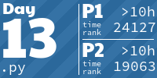
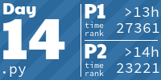
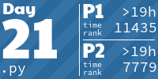

# advent-of-code-2024
 
 A place for me to attempt 2024's [Advent of Code](https://adventofcode.com/2024/) challenges

<!-- AOC TILES BEGIN -->
<h1 align="center">
  2024 - 26 ⭐ - Python
</h1>

<!-- AOC TILES END -->

<!--[Day 1 (Python)](/solutions/day-01)

[Day 2 (Python)](/solutions/day-02)

[Day 3 (Python)](/solutions/day-03)

[Day 4 (Python)](/solutions/day-04)

[Day 5 (Python)](/solutions/day-05)

[Day 6 (Python)](/solutions/day-06)

[Day 7 (Python)](/solutions/day-07)

[Day 8 (Python)](/solutions/day-08)

[Day 9 (Python)](/solutions/day-09)

[Day 10 (Python)](/solutions/day-10)

[Day 11 (Python)](/solutions/day-11)

[Day 12 (Python)](/solutions/day-12)

[Day 13 (Python)](/solutions/day-13)

<!--[Day 14 (Python)](/solutions/day-14)

[Day 15 (Python)](/solutions/day-15)

[Day 16 (Python)](/solutions/day-16)

[Day 17 (Python)](/solutions/day-17)

[Day 18 (Python)](/solutions/day-18)

[Day 19 (Python)](/solutions/day-19)

[Day 20 (Python)](/solutions/day-20)

[Day 21 (Python)](/solutions/day-21)

[Day 22 (Python)](/solutions/day-22)

[Day 23 (Python)](/solutions/day-23)

[Day 24 (Python)](/solutions/day-24)

[Day 25 (Python)](/solutions/day-25) -->