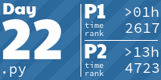

# advent-of-code-2024
 
<!-- AOC TILES BEGIN -->
<h1 align="center">
  Advent of Code - 397/484 ⭐
</h1>
<h1 align="center">
  2024 - 34 ⭐ - Python
</h1>

<h1 align="center">
  2023 - 50 ⭐ - Python
</h1>

<h1 align="center">
  2022 - 50 ⭐ - Python
</h1>

<h1 align="center">
  2021 - 50 ⭐ - Python
</h1>

<h1 align="center">
  2020 - 50 ⭐ - 
</h1>

<h1 align="center">
  2019 - 50 ⭐ - Python
</h1>

<h1 align="center">
  2018 - 10 ⭐ - Python
</h1>

<h1 align="center">
  2017 - 8 ⭐ - Python
</h1>

<h1 align="center">
  2016 - 45 ⭐ - Python
</h1>

<h1 align="center">
  2015 - 50 ⭐ - Python
</h1>

<!-- AOC TILES END -->